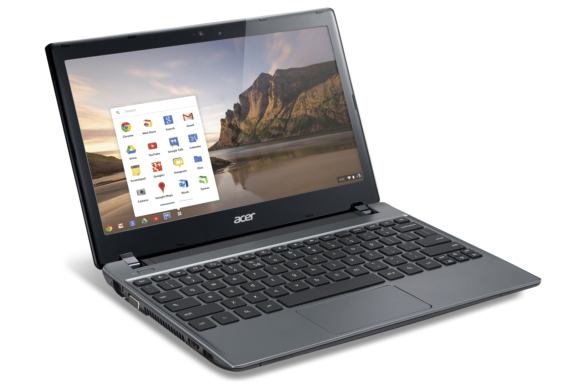
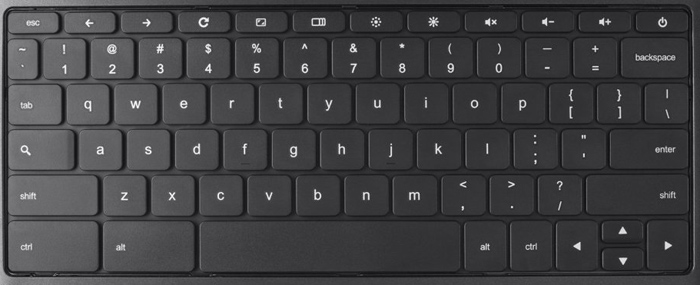

Chromebook
==========

Various companies make Chromebooks, include Dell, HP, Acer and Asus. Although there are a multitude of companies producing the Chromebooks, internally they are relatively the same, offering 2 or 4 gigabytes of RAM and either 16 or 32 gigabyte SSD.

.. TODO: Include picture of a Chromebook

They look and act like conventional laptops, but with a few differences:

- Boot up: Chromebooks will start up in less than 8 seconds. In fact, at the log in screen a Chromebook will shut off instead of going to sleep because they start up so fast.
- Only Chrome: Chromebooks only run one application, Chrome, a web browser built by Google. Through Chrome, various online web applications are availble. 
- Network access: Since they only run Chrome, Chromebooks are limited in the absence of Internet access. A lot of web applications (including GAfE) now support offline access, so they can be used without a network connection.

Care and use of a Chromebook is no different than using a Windows/OS X/Linux laptop. Chromebooks plug in and charge just like normal, and usually can last 8-10 hours on a single charge.

Keyboard
--------

The Chromebook keyboard is slightly different:

Instead of the F1-F12 row of keys, a Chromebook will have a row of keys specific to use with the Chrome browser. Also, instead of a **Caps Lock** key, there is a **Search** key, allowing the user to quickly perform searches.