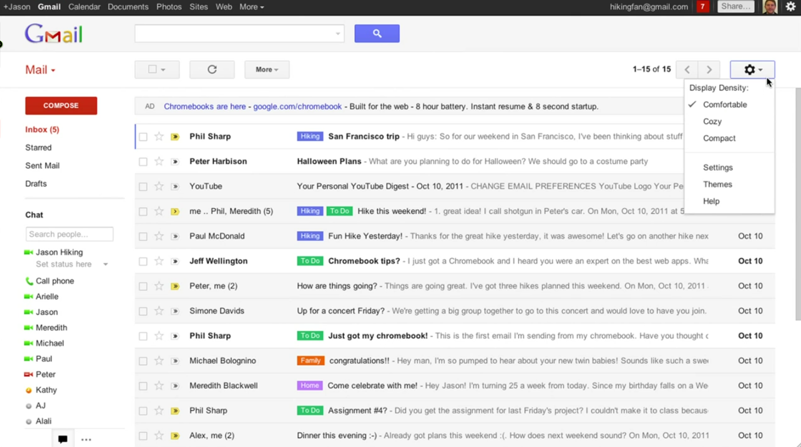
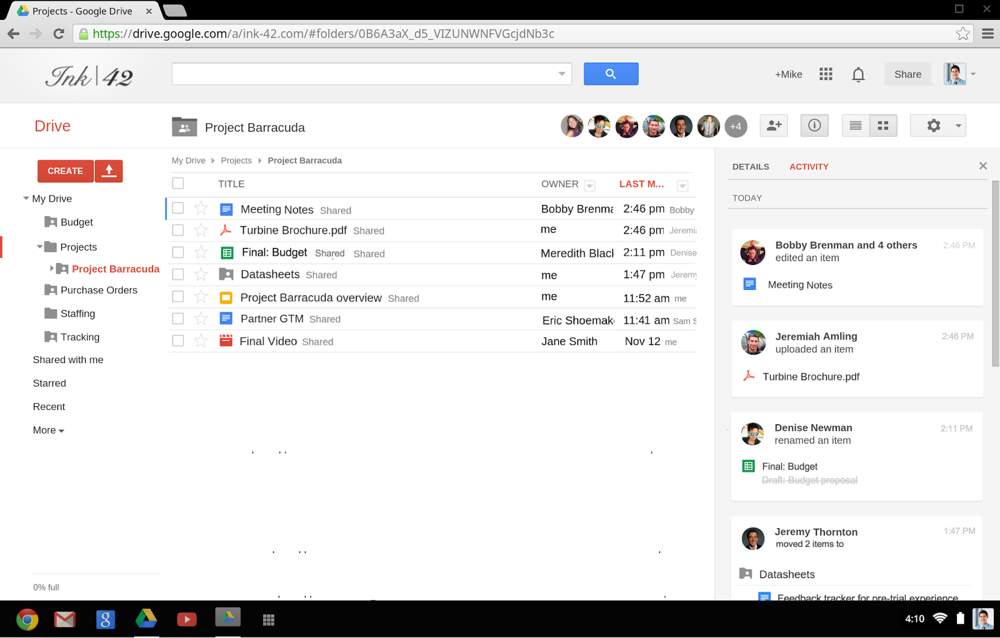
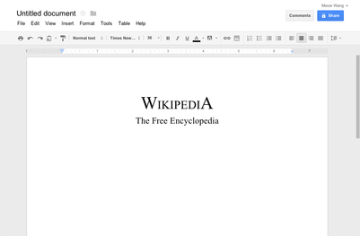
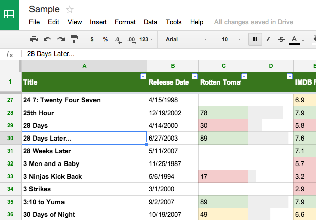
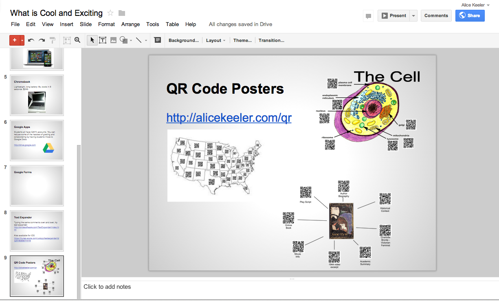
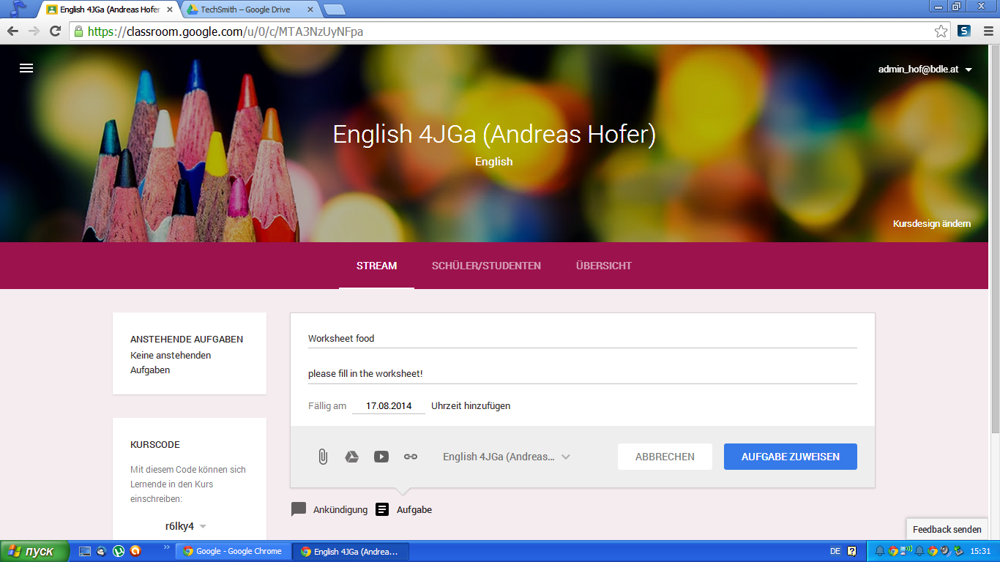

Google Apps for Education
=========================

There are over 20 Google Apps in Google Apps for Education (GAfE), but for the first year of implementation the district will focus on the following apps. Additional apps will be available for experimentation and/or use by staff and students, but because of time limitations, professional development will not be offer in the first year.

Gmail
-----

What started out as an April Fool's joke is now a powerful web based email client. One very big difference when compared to traditional email clients is the replacement of the idea of folders with labels. Whereas an email can be placed in one folder for organizational purposes, in Gmail, an email can have multiple labels. For example, an email from your boss about Project X can be labeled with **The Boss** and **Project X**, allowing you to find the email in either place.

Google Drive
------------

Google offers cloud storage in the form of Google Drive. Users can upload any file to Google Drive for storage and sharing. There is also a Google Drive application for Windows and OS X that will keep a local folder in sync with Google Drive. Documents created in web apps such as Google Docs, Sheets, and Slides is also stored in Google Drive.

Google Docs
-----------

Docs is the web based word processor for Google Apps for Education. Although it can be limiting in the formatting of documents, the collaboration capabilities are unparalleled in other word processors. Most of the formatting tools will look familiar.

Google Sheets
-------------

For spreadsheet duties, Google Apps for Education offers Google Sheets. A highly functional spreadsheet that also includes collaboration capabilities.

Google Slides
-------------

Google Slides is a feature packed presentation program. Although it is limited when it comes to multimedia, it has the same high level collaboration capabilities as Docs and Sheets.

Google Classroom
----------------

Google only recently released their learning management system (LMS) called simply Classroom. At this stage Google Classroom offers a very rudimentary LMS, missing a lot of features. Most notably, there are no quiz or test taking features at this time. It does integrate well with Drive, allowing assignments to be handed in electronically.
