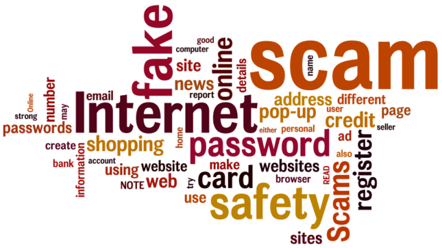

Online Safety
=============

Staying safe online has become a requirement for not only students, but staff as well. With the rise in attempted phishing attacks and the loss of personal privacy, it is important to stress due diligence when working and accessing information online.

The online safety training will cover the following topics:

- Personal information
- Filtering of obscene or pornographic content
- Sending and receiving of pictures
- Validating information gathered from websites
- Metadata created from visiting sites, communicating, and using apps online